# Data model (ERD)

Source of truth: [`prisma/schema.prisma`](../prisma/schema.prisma). This diagram shows the main
fields and relationships; timestamps and most optional fields are left out.

## Conventions

| Topic              | Rule                                                                                                                                                                                                |
| ------------------ | --------------------------------------------------------------------------------------------------------------------------------------------------------------------------------------------------- |
| Money              | `Int` in **paise** (₹499 = `49900`). Never floats.                                                                                                                                                  |
| Tax rates          | `Int` in **basis points** (18% = `1800`). Product rate → category rate → `StoreSettings.defaultTaxRateBps`.                                                                                         |
| Translations       | `Json` like `{ "en": "…", "ta": "…", "kn": "…" }`, validated by `src/lib/validators/localized.ts`, read with `localize()`; missing locales fall back to the default.                                |
| Product attributes | `Category → AttributeDefinition[]` (TEXT, NUMBER, SELECT, COLOR). Values live in `Product.attributes` JSON keyed by `AttributeDefinition.key`, validated by `productAttributesSchema()`.            |
| Variants           | Every product has **at least one** `ProductVariant`; stock, price and SKU always live on the variant. Variant axes are in `Product.options`, each variant's picks in `ProductVariant.optionValues`. |
| Deleting products  | Set `status = ARCHIVED`. Categories with products cannot be deleted (`Restrict`).                                                                                                                   |
| Orders             | `Order` and `OrderItem` store a **snapshot** (address, product name, SKU, price, tax) so later catalog edits never change past orders.                                                              |
| Idempotency        | `WebhookEvent (provider, eventId)` is unique; `Payment.providerPaymentId` is unique.                                                                                                                |
| DB constraints     | CHECKs in the init migration: stock ≥ 0, prices ≥ 0, quantity > 0, rating 1–5, percentage coupon ≤ 100%, refund ≤ amount, single `StoreSettings` row.                                               |
| State codes        | Two-letter Indian state codes (`KA`, `TN`, …) in addresses, shipping rules and `StoreSettings.stateCode` (GST: same state → CGST+SGST, else IGST).                                                  |

## Diagram

```mermaid
erDiagram
    StoreSettings {
        string id PK "always 'default'"
        string name
        json tagline "localized"
        string primaryColor
        string gstNumber
        string stateCode
        bool pricesIncludeTax
        int defaultTaxRateBps
        string[] supportedLocales
        string defaultLocale
        bool codEnabled
        int codFee "paise"
        json features
    }
    ShippingRule {
        string id PK
        int priority
        string[] pincodePrefixes
        string[] stateCodes
        enum rateType "FLAT | WEIGHT_BASED"
        int flatRate "paise"
        int freeShippingThreshold "paise"
    }
    HomeSection {
        string id PK
        enum type
        json config
        int sortOrder
    }
    Banner {
        string id PK
        json title "localized"
        string imageUrl
        int sortOrder
    }

    User {
        string id PK
        string email UK
        string phone UK
        string passwordHash "staff only"
        enum role "OWNER | STAFF | CUSTOMER"
    }
    Address {
        string id PK
        string userId FK
        string pincode
        string stateCode
        bool isDefault
    }

    Category {
        string id PK
        string slug UK
        json name "localized"
        string parentId FK
        int taxRateBps
        string hsnCode
    }
    AttributeDefinition {
        string id PK
        string categoryId FK
        string key "unique per category"
        json label "localized"
        enum type "TEXT | NUMBER | SELECT | COLOR"
        json options
        bool isFilterable
        bool isRequired
    }
    Product {
        string id PK
        string slug UK
        json name "localized"
        string categoryId FK
        enum status "DRAFT | PUBLISHED | ARCHIVED"
        json attributes
        json options "variant axes"
        int taxRateBps
    }
    ProductVariant {
        string id PK
        string productId FK
        string sku UK
        json optionValues
        int price "paise"
        int compareAtPrice "paise"
        int stock "CHECK >= 0"
        int weightGrams
    }
    ProductImage {
        string id PK
        string productId FK
        string variantId FK
        string url
        json alt "localized"
        int sortOrder
    }

    Cart {
        string id PK
        string userId FK,UK
    }
    CartItem {
        string id PK
        string cartId FK
        string variantId FK
        int quantity
    }
    WishlistItem {
        string id PK
        string userId FK
        string productId FK
    }
    Review {
        string id PK
        string productId FK
        string userId FK
        string orderItemId FK "verified purchase"
        int rating "1-5"
        enum status "PENDING | APPROVED | REJECTED"
    }

    Coupon {
        string id PK
        string code UK
        enum type "PERCENTAGE | FLAT"
        int value "bps or paise"
        int minCartValue
        int maxDiscount
        int usageLimit
        int perUserLimit
        string[] categoryIds
        string[] productIds
    }
    CouponUsage {
        string id PK
        string couponId FK
        string orderId FK,UK
        string userId FK
        string phone
        int discountAmount
    }

    Order {
        string id PK
        string orderNumber UK
        string userId FK
        enum status
        enum paymentStatus
        enum paymentMethod "ONLINE | COD"
        json shippingAddress "snapshot"
        int subtotal
        int discountTotal
        int shippingTotal
        int codFee
        int taxTotal
        int total
        string couponId FK
        datetime expiresAt
    }
    OrderItem {
        string id PK
        string orderId FK
        string variantId FK
        json productName "snapshot"
        string sku
        int unitPrice
        int quantity
        int taxRateBps
        int lineTotal
    }
    OrderEvent {
        string id PK
        string orderId FK
        enum fromStatus
        enum toStatus
        string actorId FK
    }
    Payment {
        string id PK
        string orderId FK
        string provider
        enum status
        int amount
        int refundedAmount
        string providerOrderId UK
        string providerPaymentId UK
    }
    WebhookEvent {
        string id PK
        string provider "unique with eventId"
        string eventId
        string type
        datetime processedAt
    }

    PushSubscription {
        string id PK
        string userId FK
        string endpoint UK
    }
    Notification {
        string id PK
        string userId FK
        string orderId FK
        enum channel "EMAIL | SMS | WHATSAPP | PUSH"
        string template
        enum status
    }
    AuditLog {
        string id PK
        string actorId FK
        string action
        string entityType
        string entityId
        json changes
    }

    User ||--o{ Address : has
    User ||--o| Cart : owns
    Cart ||--o{ CartItem : contains
    ProductVariant ||--o{ CartItem : "added as"
    User ||--o{ WishlistItem : saves
    Product ||--o{ WishlistItem : "saved in"

    Category ||--o{ Category : "parent of"
    Category ||--o{ AttributeDefinition : defines
    Category ||--o{ Product : groups
    Product ||--|{ ProductVariant : "has 1+"
    Product ||--o{ ProductImage : shows
    ProductVariant ||--o{ ProductImage : "variant image"

    User ||--o{ Order : places
    Order ||--|{ OrderItem : contains
    ProductVariant ||--o{ OrderItem : "sold as"
    Order ||--o{ OrderEvent : timeline
    User ||--o{ OrderEvent : "acted on"
    Order ||--o{ Payment : "paid by"

    Coupon ||--o{ CouponUsage : "redeemed in"
    Order ||--o| CouponUsage : uses
    User ||--o{ CouponUsage : redeems
    Coupon ||--o{ Order : "applied to"

    Product ||--o{ Review : "reviewed in"
    User ||--o{ Review : writes
    OrderItem ||--o| Review : verifies

    User ||--o{ PushSubscription : subscribes
    User ||--o{ Notification : receives
    Order ||--o{ Notification : triggers
    User ||--o{ AuditLog : performs
```

`StoreSettings`, `ShippingRule`, `HomeSection`, `Banner` and `WebhookEvent` stand alone (no foreign keys).
